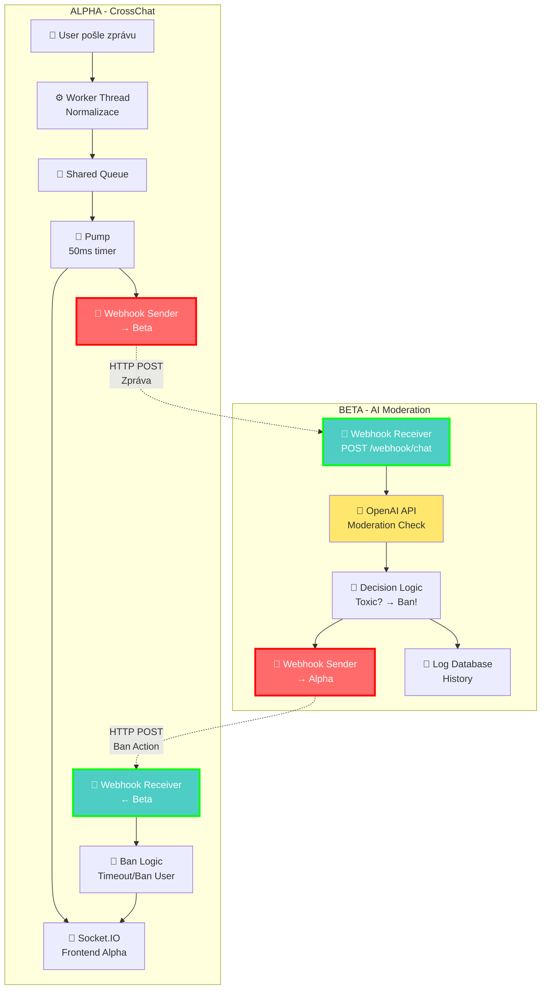

# Beta Projekt - Simplified: AI Chat Moderation

> **Jednoduchý projekt který splňuje všechny požadavky zadání**

---

## 🎯 Nápad (Simplified Beta)

**Název:** AI Chat Moderation System

**Co dělá:**
1. ✅ **Přijímá webhook** z Alpha (nová zpráva v chatu)
2. ✅ **Posílá do AI** (OpenAI Moderation API) - toxic check
3. ✅ **Posílá webhook ZPÁTKY** do Alpha (ban user pokud toxic)
4. ✅ Alpha zobrazí warning/ban uživatele

**= OBOUSMĚRNÁ WEBHOOK INTEGRACE!**

---

## ✅ Splnění Zadání

### **Alpha Projekt (CrossChat):**
```
✅ REST API (producer endpoints)
✅ WebSocket (Socket.IO pro frontend)
✅ WEBHOOK Sender (posílá zprávy → Beta)
✅ WEBHOOK Receiver (přijímá ban akce ← Beta)
✅ Worker Threads (netriviální mechanika)
✅ Business logic (agregace platforem)
```

### **Beta Projekt (AI Moderation):**
```
✅ WEBHOOK Receiver (přijímá zprávy ← Alpha)
✅ WEBHOOK Sender (posílá ban akce → Alpha)
✅ AI Integration (OpenAI Moderation API)
✅ Business logic (toxic detection + decision making)
✅ REST API (status endpoint, optional)
```

---

## 🔄 Celý Flow - Obousměrný Webhook



---

## 📝 Krok Za Krokem

### **1. User Pošle Zprávu (Alpha)**
```
User napíše: "You are an idiot!"
↓
Alpha Worker Thread zpracuje
↓
Pump vyzvedne z queue
↓
Zobrazí se v Alpha frontend
```

### **2. Alpha Pošle Webhook → Beta**
```typescript
// Alpha: src/lib/webhook-sender.ts

await fetch(process.env.BETA_MODERATION_URL, {
  method: 'POST',
  headers: {
    'Content-Type': 'application/json',
    'X-Webhook-Secret': process.env.BETA_SECRET
  },
  body: JSON.stringify({
    event: 'chat.message',
    data: {
      id: 'a1b2c3...',
      streamerId: 'user-123',
      user: 'ToxicGuy',
      text: 'You are an idiot!',
      platform: 'Twitch',
      timestamp: 1733097612345
    }
  })
});
```

### **3. Beta Přijme Webhook**
```typescript
// Beta: app/api/webhook/chat/route.ts

export async function POST(req: Request) {
  // Ověř secret
  const secret = req.headers.get('x-webhook-secret');
  if (secret !== process.env.ALPHA_SECRET) {
    return NextResponse.json({ error: 'Unauthorized' }, { status: 401 });
  }
  
  // Parse data
  const { event, data } = await req.json();
  
  if (event === 'chat.message') {
    // Pošli na AI kontrolu
    await checkMessage(data);
  }
  
  return NextResponse.json({ received: true });
}
```

### **4. Beta Pošle Do AI (OpenAI Moderation API)**
```typescript
// Beta: lib/moderation.ts

async function checkMessage(message: ChatMessage) {
  console.log(`[AI] Checking message: "${message.text}"`);
  
  // OpenAI Moderation API
  const response = await fetch('https://api.openai.com/v1/moderations', {
    method: 'POST',
    headers: {
      'Content-Type': 'application/json',
      'Authorization': `Bearer ${process.env.OPENAI_API_KEY}`
    },
    body: JSON.stringify({
      input: message.text
    })
  });
  
  const result = await response.json();
  
  // Response vypadá takto:
  // {
  //   "results": [{
  //     "flagged": true,
  //     "categories": {
  //       "hate": false,
  //       "harassment": true,
  //       "self-harm": false,
  //       "sexual": false,
  //       "violence": false
  //     },
  //     "category_scores": {
  //       "harassment": 0.85,
  //       ...
  //     }
  //   }]
  // }
  
  const moderation = result.results[0];
  
  console.log(`[AI] Flagged: ${moderation.flagged}`);
  console.log(`[AI] Categories:`, moderation.categories);
  
  // Rozhodování
  if (moderation.flagged) {
    const severity = calculateSeverity(moderation);
    
    // Ulož do DB (log)
    await logToxicMessage(message, moderation);
    
    // Pošli webhook ZPÁTKY do Alpha
    await sendBanAction(message, severity);
  }
}
```

### **5. Beta Rozhodne O Akci**
```typescript
// Beta: lib/moderation.ts

function calculateSeverity(moderation) {
  const scores = moderation.category_scores;
  
  // Vysoké skóre = perma ban
  if (scores.harassment > 0.9 || scores.hate > 0.9) {
    return 'ban';
  }
  
  // Střední skóre = timeout
  if (scores.harassment > 0.7 || scores.hate > 0.7) {
    return 'timeout';
  }
  
  // Nízké skóre = warning
  return 'warning';
}
```

### **6. Beta Pošle Webhook ZPÁTKY → Alpha**
```typescript
// Beta: lib/webhook-sender.ts

async function sendBanAction(message: ChatMessage, action: string) {
  console.log(`[Webhook] Sending ${action} action to Alpha`);
  
  const duration = action === 'timeout' ? 600 : null; // 10 min
  
  await fetch(process.env.ALPHA_MODERATION_URL, {
    method: 'POST',
    headers: {
      'Content-Type': 'application/json',
      'X-Webhook-Secret': process.env.ALPHA_SECRET
    },
    body: JSON.stringify({
      event: 'moderation.action',
      data: {
        streamerId: message.streamerId,
        username: message.user,
        action: action,           // 'ban' | 'timeout' | 'warning'
        duration: duration,       // seconds (pro timeout)
        reason: 'AI detected toxic content',
        messageId: message.id,
        timestamp: Date.now()
      }
    })
  });
  
  console.log('[Webhook] ✅ Ban action sent to Alpha');
}
```

### **7. Alpha Přijme Webhook ← Beta**
```typescript
// Alpha: src/app/api/moderation/action/route.ts

export async function POST(req: Request) {
  // Ověř secret
  const secret = req.headers.get('x-webhook-secret');
  if (secret !== process.env.BETA_SECRET) {
    return NextResponse.json({ error: 'Unauthorized' }, { status: 401 });
  }
  
  // Parse data
  const { event, data } = await req.json();
  
  if (event === 'moderation.action') {
    console.log(`[Moderation] ${data.action} user: ${data.username}`);
    
    // Ulož do ban list
    await addToBanList(data);
    
    // Notifikuj frontend přes Socket.IO
    io.to(`streamer:${data.streamerId}`).emit('moderation:action', {
      username: data.username,
      action: data.action,
      reason: data.reason,
      duration: data.duration
    });
  }
  
  return NextResponse.json({ applied: true });
}
```

### **8. Alpha Zobrazí Warning/Ban**
```typescript
// Alpha Frontend: components/stream-dashboard.tsx

socket.on('moderation:action', (data) => {
  // Zobraz toast notifikaci
  toast.error(
    `User "${data.username}" was ${data.action}ed: ${data.reason}`,
    { duration: 5000 }
  );
  
  // Přidej indikátor do chatu
  setMessages(prev => prev.map(msg => 
    msg.user === data.username
      ? { ...msg, moderated: true, action: data.action }
      : msg
  ));
  
  // Disable input pro zabanovaného usera (pokud je to on)
  if (currentUser.username === data.username) {
    setCanSendMessages(false);
    showBanModal(data);
  }
});
```

---

## 💻 Beta Projekt - Minimální Implementace

### **Struktura:**
```
beta-moderation/
├── app/
│   └── api/
│       └── webhook/
│           └── chat/
│               └── route.ts         # Přijímá webhook ← Alpha
├── lib/
│   ├── moderation.ts                # OpenAI integration
│   ├── webhook-sender.ts            # Posílá webhook → Alpha
│   └── db.ts                        # Log database
├── .env.local
└── package.json
```

### **Dependencies:**
```json
{
  "name": "beta-ai-moderation",
  "dependencies": {
    "next": "^14.0.0",
    "openai": "^4.20.0",
    "postgres": "^3.4.0"
  }
}
```

### **Environment Variables:**
```bash
# .env.local

# OpenAI
OPENAI_API_KEY=sk-...

# Alpha webhook integration
ALPHA_MODERATION_URL=http://localhost:3000/api/moderation/action
ALPHA_SECRET=shared_secret_123

# Beta webhook receiver
BETA_SECRET=shared_secret_456
```

---

## 📊 Database Schema (Minimální)

```sql
-- Tabulka: moderation_log
-- Uloží historii všech kontrol

CREATE TABLE moderation_log (
  id          VARCHAR(36) PRIMARY KEY,
  message_id  VARCHAR(36) NOT NULL,
  streamer_id VARCHAR(36) NOT NULL,
  username    VARCHAR(100) NOT NULL,
  text        TEXT NOT NULL,
  flagged     BOOLEAN NOT NULL,
  categories  JSON,            -- { harassment: true, hate: false, ... }
  scores      JSON,            -- { harassment: 0.85, hate: 0.1, ... }
  action      VARCHAR(20),     -- 'ban' | 'timeout' | 'warning' | 'none'
  timestamp   TIMESTAMP DEFAULT NOW()
);

-- Index pro rychlé vyhledávání
CREATE INDEX idx_moderation_username ON moderation_log(username);
CREATE INDEX idx_moderation_streamer ON moderation_log(streamer_id);
```

---

## 🎯 Proč Toto Splňuje Zadání

### **✅ Webhook (obousměrný!):**
```
Alpha → Webhook → Beta  (nová zpráva)
Beta → Webhook → Alpha  (ban akce)

= 2× webhook usage!
```

### **✅ Netriviální Mechanika:**
```
- AI integration (OpenAI API)
- Real-time decision making
- Automatic moderation
- Severity calculation
```

### **✅ Business Logic / Přidaná Hodnota:**
```
- Není to jen "proxy" - rozhoduje o akci
- Severity algorithm (ban vs timeout vs warning)
- Learning from data (log všech checks)
- Automatic toxic content removal
```

### **✅ Integrace:**
```
Alpha a Beta spolu komunikují OBOUSMĚRNĚ
Alpha notifikuje Beta o zprávách
Beta notifikuje Alpha o ban akcích
```

---

## ⏱️ Latence (End-to-End)

```
T=0ms:    User pošle toxic zprávu v Alpha
T=65ms:   Zpráva zobrazena v Alpha frontend
T=70ms:   Alpha pošle webhook → Beta
T=75ms:   Beta přijme webhook
T=80ms:   Beta volá OpenAI API
T=350ms:  OpenAI vrátí výsledek (avg 270ms)
T=355ms:  Beta rozhodne o akci
T=360ms:  Beta pošle webhook → Alpha
T=365ms:  Alpha přijme ban action
T=370ms:  Alpha zobrazí warning/ban
T=375ms:  ✅ User vidí že byl zabanován

CELKEM: ~375ms od poslání toxic zprávy do zobrazení banu!
```

---

## 🚀 MVP (Minimum Viable Product)

### **Co MUSÍ Beta Mít:**

**1. Webhook Receiver:**
```typescript
POST /api/webhook/chat
→ Přijme zprávu z Alpha
→ Ověří secret
```

**2. OpenAI Integration:**
```typescript
→ Pošle text do OpenAI Moderation API
→ Dostane toxic score
```

**3. Webhook Sender:**
```typescript
→ Pokud toxic → pošli webhook zpátky do Alpha
→ Alpha zabanuje usera
```

**To je všechno!** Zbtek je bonus.

---

## 📋 Implementační Checklist

### **Alpha (CrossChat) - Co Přidat:**

```
✅ Webhook sender (máš v PROJECT-INTEGRATION.md)
□ Webhook receiver endpoint:
   POST /api/moderation/action
   → Přijme ban action z Beta
   → Ulož do ban list
   → Notifikuj frontend přes Socket.IO

□ Frontend handling:
   → Toast notification pro ban
   → Visual indicator (zabanovaná zpráva)
   → Disable input pro banned user
```

### **Beta (AI Moderation) - Co Implementovat:**

```
□ Webhook receiver endpoint:
   POST /api/webhook/chat
   → Přijme zprávy z Alpha
   → Ověří secret

□ OpenAI integration:
   → Zaregistruj OpenAI account
   → API key
   → Moderation API volání

□ Decision logic:
   → Severity calculation
   → Ban vs timeout vs warning

□ Webhook sender:
   → Pošli ban action zpátky do Alpha

□ Database (volitelné):
   → Log všech checks
   → History
```

---

## 💡 Bonus Features (Pokud Máš Čas)

### **1. Admin Dashboard (Beta):**
```
- Zobraz historii všech toxic zpráv
- Statistiky (kolik % zpráv je toxic)
- Manual review queue (false positives)
- Whitelist/blacklist slova
```

### **2. Konfigurovatelné Thresholdy:**
```
- Admin může nastavit kdy ban vs timeout
- Per-streamer settings
- Category weights (hate = 2× harassment)
```

### **3. Appeal System:**
```
- User může podat appeal
- Admin review
- Unban endpoint
```

### **4. Rate Limiting:**
```
- Max X checks per minute (OpenAI costs money!)
- Cache results (stejný text = stejný výsledek)
```

---

## 💰 Náklady (OpenAI)

OpenAI Moderation API je **ZDARMA!** 🎉

```
Pricing: $0.00 per 1K tokens
Limit: 10,000 requests per minute
```

**= Můžeš kontrolovat tisíce zpráv zdarma!**

---

## 🎯 Shrnutí

### **Beta Projekt Je:**
```
✅ Jednoduchý (3 hlavní komponenty)
✅ Splňuje zadání (webhook obousměrně)
✅ Užitečný (automatic moderation)
✅ Levný (OpenAI Moderation zdarma)
✅ Rychlý (celá latence ~375ms)
```

### **Flow:**
```
1. Alpha pošle zprávu → Beta (webhook)
2. Beta pošle do OpenAI → AI check
3. Beta pošle akci → Alpha (webhook)
4. Alpha zabanuje usera
```

### **Obousměrný Webhook:**
```
Alpha ←→ Beta

Alpha posílá: chat messages
Beta posílá:  ban actions
```

---

## ✅ Odpověď Na Tvou Otázku:

**Ano, tento simplified Beta projekt:**
- ✅ Používá webhook (obousměrně!)
- ✅ Má business logic (AI decision making)
- ✅ Přidává hodnotu (automatic moderation)
- ✅ Splňuje VŠECHNY požadavky zadání
- ✅ Je JEDNODUŠŠÍ než full analytics dashboard
- ✅ Je UŽITEČNÝ (odstraní toxic content)

**= PERFEKTNÍ VOLBA! 🎯**

---

**Doporučuji tento přístup! Je to jednodušší, užitečnější a splňuje všechno! 🚀**


