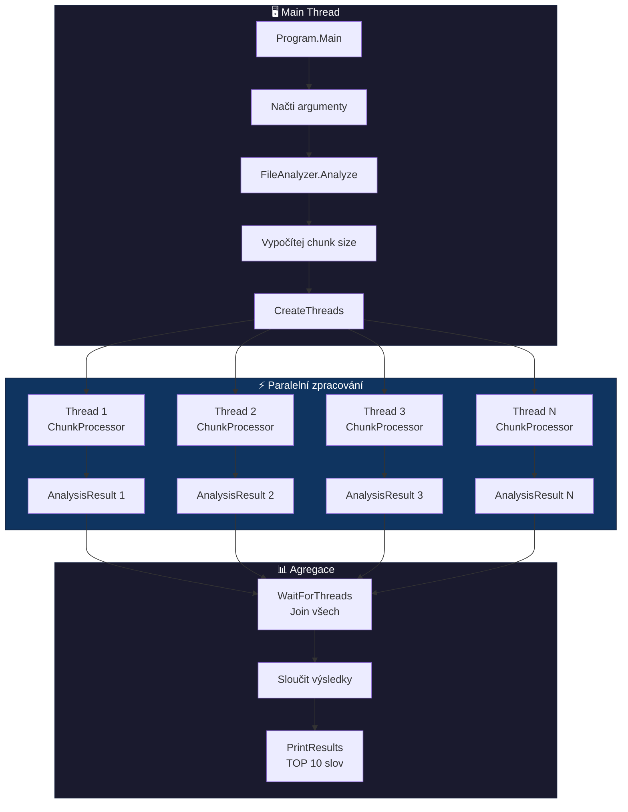
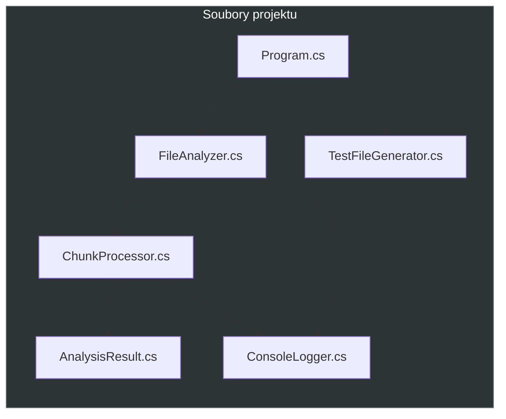
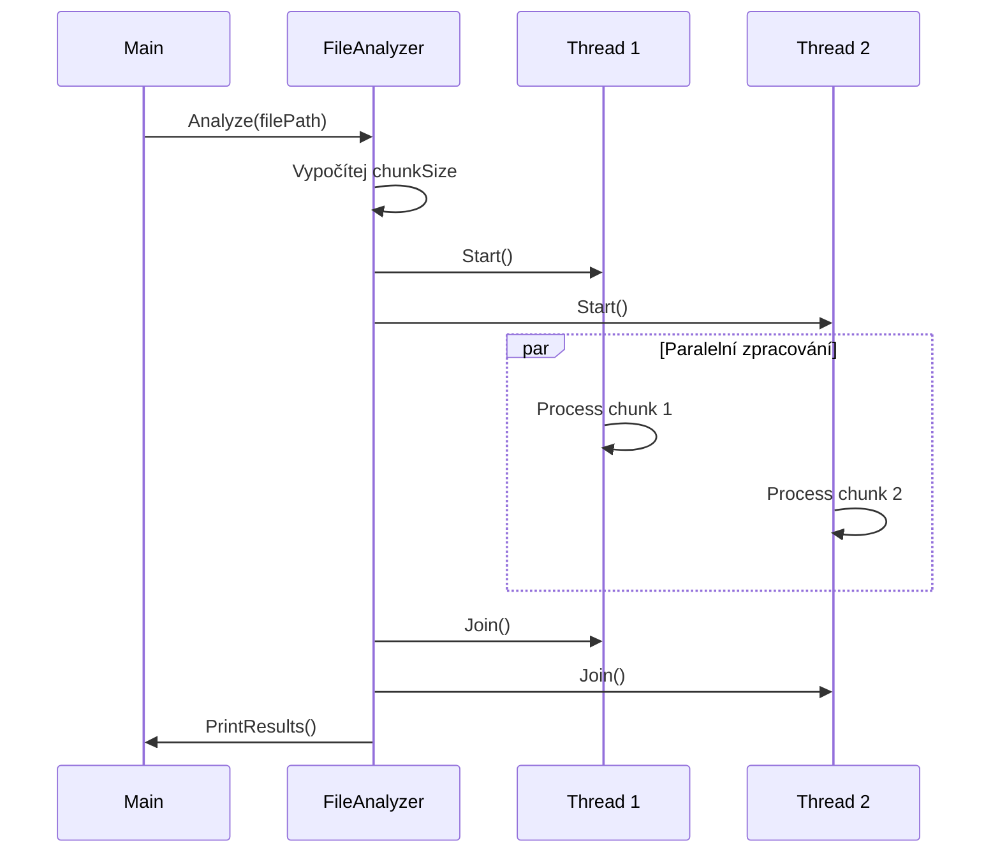
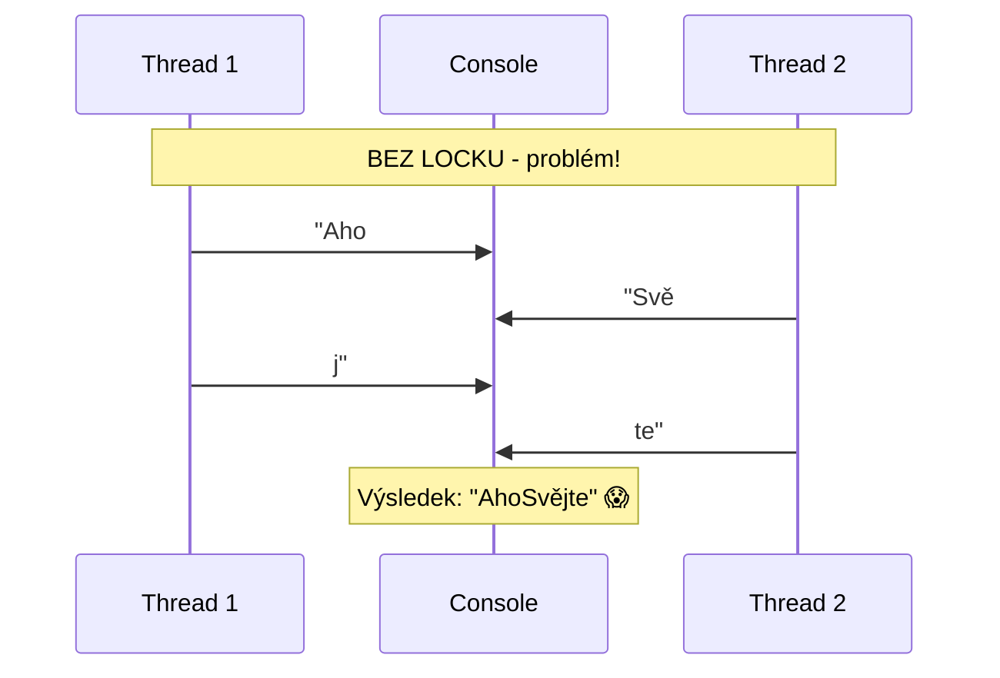
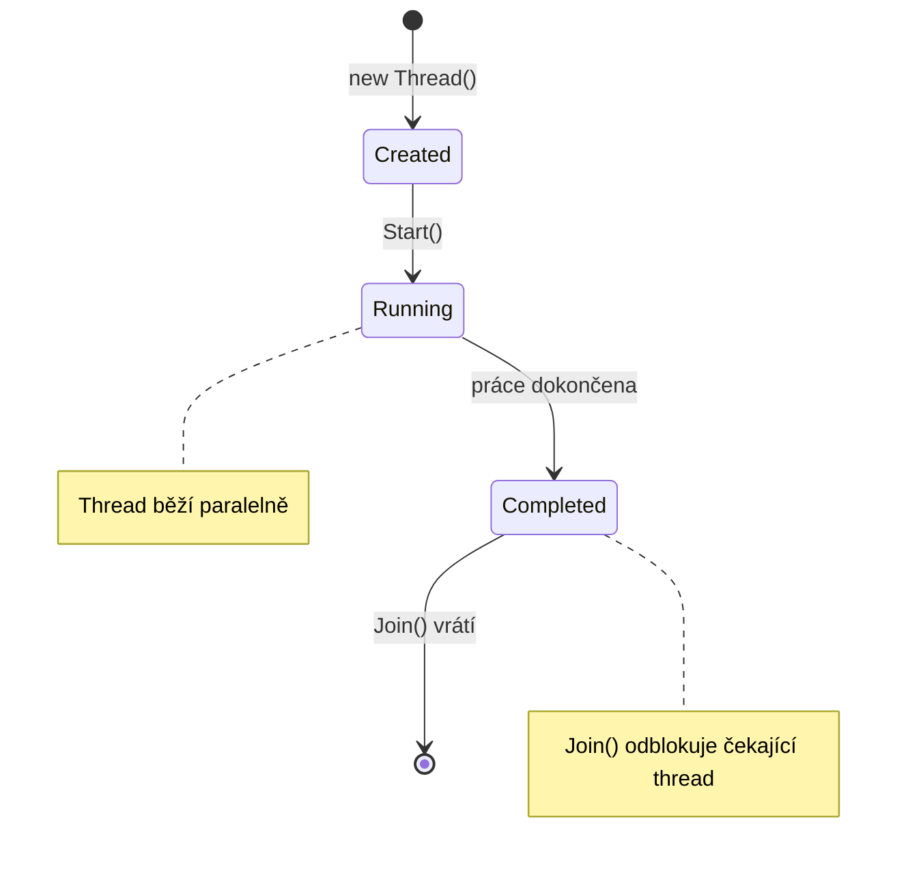

# 📚 Parallel File Analyzer - Kompletní dokumentace

## 🎯 Přehled projektu

Paralelní analyzátor textových souborů v C#. Rozdělí soubor na chunky a každý thread zpracovává svou část současně.

---

## 🔄 Flow diagram



---

## 📁 Struktura souborů



| Soubor | Účel |
|--------|------|
| `Program.cs` | Vstupní bod, zpracování argumentů |
| `FileAnalyzer.cs` | Koordinátor - vytváří thready, sbírá výsledky |
| `ChunkProcessor.cs` | Zpracování jednoho chunku v threadu |
| `AnalysisResult.cs` | Datová třída pro výsledky |
| `ConsoleLogger.cs` | Thread-safe logování |
| `TestFileGenerator.cs` | Generátor testovacích souborů |

---

## 📄 Program.cs - Vstupní bod

### Účel
Hlavní vstupní bod programu, zpracování argumentů příkazové řádky.

### Metody

#### `Main(string[] args)`
- Vytvoří instanci `ConsoleLogger` pro logování
- Zavolá `GetFilePath()` pro získání cesty k souboru
- Zavolá `GetThreadCount()` pro získání počtu threadů
- Vytvoří `FileAnalyzer` a spustí analýzu

#### `GetFilePath(string[] args, ConsoleLogger logger)`
**Co dělá:** Získá cestu k souboru, který se má analyzovat.

**Jak funguje:**
1. Pokud uživatel zadal argument `args[0]` A soubor existuje → vrátí tuto cestu
2. Pokud ne → zkontroluje, jestli existuje `testfile.txt`
3. Pokud `testfile.txt` neexistuje → zavolá `TestFileGenerator.Create()` a vygeneruje 100 000 řádků
4. Vrátí cestu k testovacímu souboru

#### `GetThreadCount(string[] args)`
**Co dělá:** Zjistí, kolik threadů použít.

**Jak funguje:**
1. Pokud je zadán druhý argument `args[1]` a je to číslo → použije ho
2. Omezí hodnotu na rozsah **1-16** pomocí `Math.Max(1, Math.Min(count, 16))`
3. Pokud argument není → vrátí výchozí hodnotu **4**

---

## 🎛️ FileAnalyzer.cs - Koordinátor

### Účel
Hlavní třída, která řídí celou analýzu - vytváří thready, rozděluje práci, sbírá výsledky.

### Privátní proměnné
| Proměnná | Typ | Popis |
|----------|-----|-------|
| `_threadCount` | int | Počet threadů k použití |
| `_logger` | ConsoleLogger | Instance loggeru |
| `_results` | AnalysisResult[] | Pole kde každý thread uloží svůj výsledek |

### Metody

#### `Analyze(string filePath)`
**Co dělá:** Spustí celou analýzu souboru.

**Jak funguje:**
1. Získá velikost souboru pomocí `FileInfo`
2. Vypočítá velikost jednoho chunku: `chunkSize = fileSize / threadCount`
3. Vytvoří pole pro výsledky `_results = new AnalysisResult[_threadCount]`
4. Zaměří čas pomocí `DateTime.Now`
5. Zavolá `CreateThreads()` → `StartThreads()` → `WaitForThreads()`
6. Po dokončení všech threadů zavolá `PrintResults()`



#### `CreateThreads(string filePath, long fileSize, long chunkSize)`
**Co dělá:** Vytvoří pole threadů, každý s přiřazeným chunkem souboru.

**Jak funguje:**
1. Pro každý thread (0 až `_threadCount - 1`):
   - Vypočítá `startPos = i * chunkSize` (kde v souboru začít)
   - Vypočítá `endPos`:
     - Pro poslední thread = `fileSize` (až do konce souboru)
     - Pro ostatní = `(i + 1) * chunkSize`
   - Vytvoří nový `ChunkProcessor` s těmito pozicemi
   - Vytvoří nový `Thread` s lambda funkcí
   - Pojmenuje thread `"Worker-{i+1}"`

> [!warning] Closure problém
> ```csharp
> int threadId = i;  // MUSÍ být lokální kopie!
> ```
> Proč? Protože lambda funkce "zachytí" proměnnou `i`. Kdyby se použilo přímo `i`, všechny thready by viděly stejnou hodnotu (poslední hodnotu z cyklu). Lokální kopie `threadId` zajistí, že každý thread má svou vlastní hodnotu.

#### `StartThreads(Thread[] threads)`
**Co dělá:** Spustí všechny thready.

**Jak funguje:** Foreach cyklem zavolá `thread.Start()` na každý thread. Thready začnou běžet **paralelně** - metoda nečeká na jejich dokončení.

#### `WaitForThreads(Thread[] threads)`
**Co dělá:** Čeká, až všechny thready dokončí práci.

**Jak funguje:** Foreach cyklem zavolá `thread.Join()` na každý thread. `Join()` **zablokuje** hlavní thread, dokud daný worker thread neskončí.

#### `PrintResults(TimeSpan elapsed)`
**Co dělá:** Agreguje výsledky ze všech threadů a vypíše je.

**Jak funguje:**
1. Projde všechny výsledky v `_results[]`
2. Sečte `totalWords` a `totalLines`
3. Sloučí slovníky frekvencí slov
4. Vypíše celkové statistiky a čas
5. Zavolá `PrintTopWords()` pro TOP 10

#### `PrintTopWords(Dictionary<string, int> frequency, int count)`
**Co dělá:** Vypíše N nejčastějších slov.

**Jak funguje:**
1. Převede slovník na `List<KeyValuePair<string, int>>`
2. Seřadí seznam sestupně podle hodnoty pomocí `Sort()` s custom komparátorem
3. Vypíše prvních N položek

---

## ⚙️ ChunkProcessor.cs - Worker

### Účel
Každý thread má svou instanci. Zpracovává přidělenou část souboru.

### Privátní proměnné
| Proměnná | Typ | Popis |
|----------|-----|-------|
| `_filePath` | string | Cesta k souboru |
| `_startPos` | long | Bajtová pozice kde začít |
| `_endPos` | long | Bajtová pozice kde skončit |
| `_logger` | ConsoleLogger | Instance loggeru |

### Metody

#### `Process()`
**Co dělá:** Zpracuje chunk a vrátí `AnalysisResult`.

**Jak funguje:**
1. Otevře soubor s `FileShare.Read` - umožňuje více threadům číst současně
2. Pomocí `stream.Seek(_startPos, SeekOrigin.Begin)` skočí na startovní pozici
3. **Pokud nezačíná od pozice 0**: zavolá `SkipToNextLine()`
4. Čte řádky dokud `stream.Position < _endPos`
5. Každý řádek zpracuje pomocí `ProcessLine()`
6. Vrátí naplněný `AnalysisResult`

> [!important] FileShare.Read
> Bez tohoto flagu by druhý thread dostal exception při pokusu otevřít soubor!

#### `SkipToNextLine(FileStream stream)`
**Co dělá:** Přeskočí na začátek dalšího řádku.

**Jak funguje:**
1. Čte bajt po bajtu pomocí `stream.ReadByte()`
2. Když najde `'\n'` (konec řádku) → skončí

```
Soubor: "hello world\nfoo bar\n..."
         ↑           ↑
      pozice 0    pozice 12

Pokud chunk začíná na pozici 7 ("orld"), 
musíme přeskočit na pozici 12 ("foo")
```

#### `ProcessLine(string line, AnalysisResult result)`
**Co dělá:** Zpracuje jeden řádek - spočítá slova a jejich frekvenci.

**Jak funguje:**
1. Zvýší `result.LineCount++`
2. Rozdělí řádek na slova pomocí `Split()` s oddělovači: ` `, `\t`, `,`, `.`, `!`, `?`
3. `StringSplitOptions.RemoveEmptyEntries` - ignoruje prázdné položky
4. Pro každé slovo delší než 2 znaky:
   - Převede na lowercase
   - Zvýší `WordCount`
   - Přidá do frekvence

---

## 📊 AnalysisResult.cs - Data

### Účel
Drží výsledky analýzy od jednoho threadu.

> [!tip] Žádná synchronizace!
> Každý thread má **svou vlastní instanci** - není potřeba synchronizace při zápisu!

### Vlastnosti
| Vlastnost | Typ | Popis |
|-----------|-----|-------|
| `WordCount` | int | Celkový počet slov |
| `LineCount` | int | Celkový počet řádků |
| `WordFrequency` | Dictionary<string, int> | Mapa slovo → počet výskytů |

### Metody

#### Konstruktor `AnalysisResult()`
Inicializuje všechny hodnoty na 0 a vytvoří prázdný slovník.

#### `AddWord(string word)`
**Co dělá:** Přidá slovo do frekvenčního slovníku.

**Jak funguje:**
1. Pokud slovo ve slovníku neexistuje → vytvoří záznam s hodnotou 0
2. Zvýší hodnotu o 1

---

## 🔒 ConsoleLogger.cs - Thread-safe výpis

### Účel
Bezpečný výpis do konzole z více threadů najednou.

### Proč je potřeba?



### Privátní proměnné
| Proměnná | Typ | Popis |
|----------|-----|-------|
| `_lock` | object | Zámek pro synchronizaci |

### Metody

#### `Log(string message)`
**Co dělá:** Vypíše zprávu s časovou značkou.

```csharp
lock (_lock)
{
    Console.WriteLine($"[{DateTime.Now:HH:mm:ss.fff}] {message}");
}
```

`lock (_lock)` zajistí, že **pouze jeden thread** může být uvnitř bloku najednou.

#### `LogWithThread(string message)`
**Co dělá:** Vypíše zprávu s názvem aktuálního threadu.

**Jak funguje:**
1. Získá název threadu: `Thread.CurrentThread.Name`
2. Pokud nemá jméno, použije ID
3. Vypíše s lockem

---

## 🧪 TestFileGenerator.cs - Generátor

### Účel
Vytváří testovací soubory s náhodnými slovy.

### Statická data
```csharp
string[] Words = {
    "parallel", "thread", "process", "lock", "sync",
    "data", "file", "read", "write", "buffer",
    "queue", "worker", "task", "result", "count"
};
```

### Metody

#### `Create(string path, int lineCount)`
**Co dělá:** Vytvoří soubor s daným počtem řádků.

#### `GenerateLine(Random random)`
**Co dělá:** Vygeneruje jeden řádek s 5-15 náhodnými slovy.

---

## 🔑 Klíčové koncepty pro zkoušku

### Thread Lifecycle



### Synchronizační mechanismy

| Mechanismus | Kde použit | Proč |
|-------------|-----------|------|
| `lock` | ConsoleLogger | Zabránit promíchání výstupů |
| `FileShare.Read` | ChunkProcessor | Umožnit více threadům číst soubor |
| `Join()` | FileAnalyzer | Počkat na dokončení threadů |

### Klíčové otázky a odpovědi

> [!faq] Proč `FileShare.Read`?
> Bez něj by druhý thread dostal exception při pokusu otevřít soubor.

> [!faq] Proč `SkipToNextLine()`?
> Aby se nezačalo číst uprostřed slova při náhodném rozdělení souboru.

> [!faq] Proč `lock` v loggeru?
> Aby se výstupy nepromíchaly.

> [!faq] Proč každý thread má svůj `AnalysisResult`?
> Není potřeba synchronizace při zápisu - žádné race conditions!

> [!faq] Co je `Join()`?
> Blokující čekání na dokončení threadu. Hlavní thread "čeká" na workera.

> [!faq] Co je closure problém?
> Lambda zachytí referenci na proměnnou, ne její hodnotu. Proto musíme vytvořit lokální kopii `int threadId = i;`

---

## 🚀 Spuštění programu

```bash
# Výchozí (4 thready, vygeneruje testfile.txt)
dotnet run

# Vlastní soubor
dotnet run mojedata.txt

# Vlastní soubor + počet threadů
dotnet run mojedata.txt 8
```

---

## 📈 Příklad výstupu

```
[14:32:15.123] === Parallel File Analyzer ===
[14:32:15.125] Soubor: testfile.txt
[14:32:15.126] Velikost: 5765.43 KB
[14:32:15.126] Pocet threadu: 4
[14:32:15.126] ----------------------------------------
[14:32:15.128] [Worker-1] Zacinam zpracovani...
[14:32:15.128] [Worker-2] Zacinam zpracovani...
[14:32:15.129] [Worker-3] Zacinam zpracovani...
[14:32:15.129] [Worker-4] Zacinam zpracovani...
[14:32:15.456] [Worker-2] Hotovo: 25000 radku, 187500 slov
[14:32:15.458] [Worker-1] Hotovo: 25000 radku, 187600 slov
[14:32:15.460] [Worker-4] Hotovo: 25001 radku, 187520 slov
[14:32:15.461] [Worker-3] Hotovo: 24999 radku, 187480 slov
[14:32:15.462] ----------------------------------------
[14:32:15.462] === VYSLEDKY ===
[14:32:15.463] Thread-1: 25000 radku, 187600 slov
[14:32:15.463] Thread-2: 25000 radku, 187500 slov
[14:32:15.463] Thread-3: 24999 radku, 187480 slov
[14:32:15.463] Thread-4: 25001 radku, 187520 slov
[14:32:15.464] ----------------------------------------
[14:32:15.464] CELKEM: 100000 radku, 750100 slov
[14:32:15.464] Cas: 336 ms

[14:32:15.465] === TOP 10 NEJCASTEJSICH SLOV ===
[14:32:15.466] 1. "thread" - 50234x
[14:32:15.466] 2. "parallel" - 50156x
...
```


